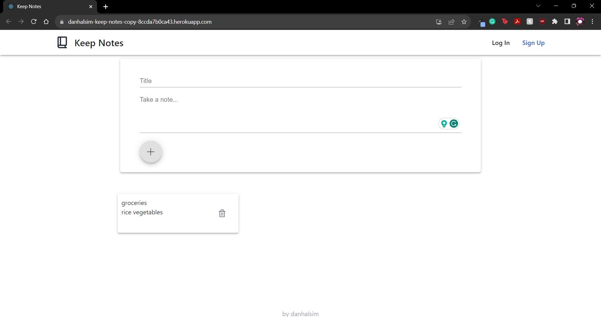

# Keep-Notes

## Description

A simple note-taker app made using React. Designed to be used like Google Keep.

https://danhalsim-keep-notes-copy-8ccda7b0ca43.herokuapp.com/

## Table of Contents

- [Installation](#installation)
- [Usage](#usage)
- [Credits](#credits)
- [License](#license)
- [Contributions](#contributions)
- [Tests](#Tests)
- [Questions](#Questions)

## Installation

N/A

## Usage

Enter a title and body into your notes. Press the plus button to save your note.

## Credits

- Tailwind: CSS framework
  - https://tailwindcss.com/
- Flowbite: Tailwind components
  - https://flowbite.com/
- Material UI
  - https://mui.com/material-ui/

## License

This project uses the MIT License.

https://opensource.org/licenses/MIT

## Contributions

N/A

## Tests

N/A

## Questions

If you have any questions about the project, please reach out!

Github: https://github.com/danhalsim

Email: dansim6935@gmail.com
